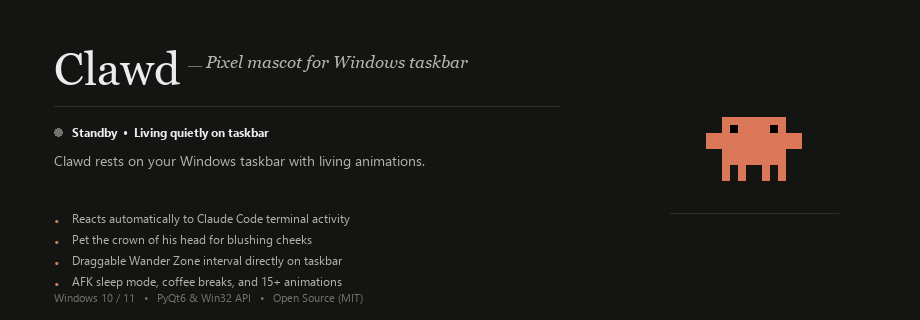
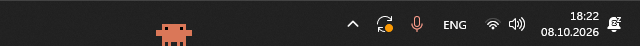
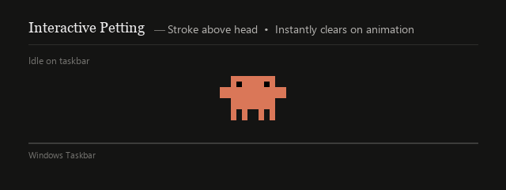
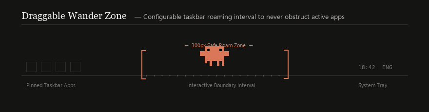
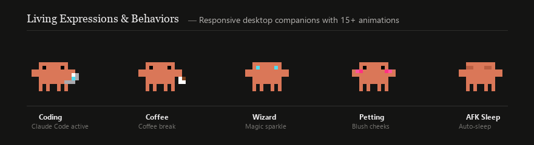
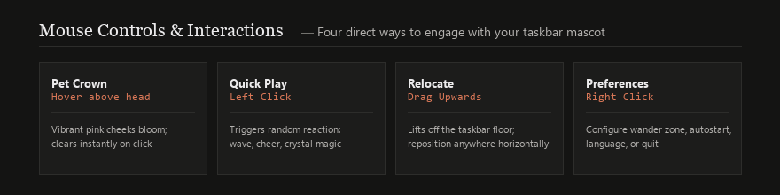
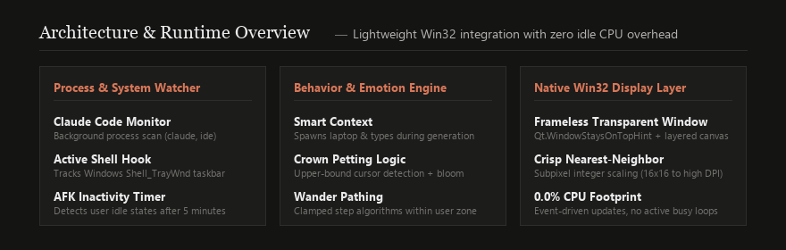
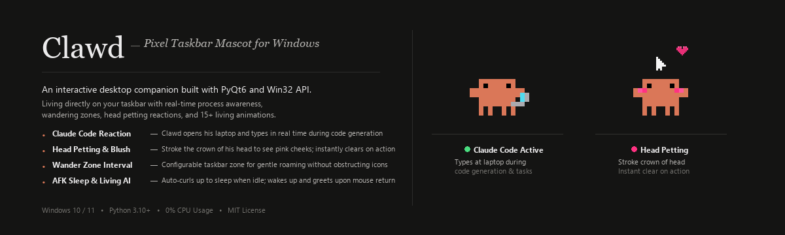

<p align="center">
  
</p>

# Clawd — Pixel Taskbar Mascot

<p align="left">
  
  
  
  
</p>

An interactive, living pixel-art companion that lives directly on your Windows taskbar. Clawd features contextual awareness for local development and Claude Code workflows, interactive crown-of-head petting with high-contrast blushing cheeks, a customizable wander interval, and over 15 handcrafted animations.

<p align="center">
  
</p>
<p align="center">
  <em>Clawd living natively on the Windows taskbar next to the notification area and running applications.</em>
</p>

---

##  Key Features

###  Smart Context & Process Awareness
* **Background Sentinel:** Continuously scans for active Claude Code processes (`claude`, `claude-code`) and coding environments.
* **Contextual Work Reaction:** Whenever code generation or tool executions occur, Clawd takes out his laptop and types alongside you in real time.
* **Task Celebration:** When the task completes, Clawd raises his arms in celebration, puts away the laptop, and returns to idle.

###  Crown Petting & High-Contrast Blush
* **Head Stroking:** Move the cursor gently across the crown of Clawd's head (the area directly above his forehead).
* **Vibrant Blush Bloom:** High-contrast hot pink cheeks bloom across his face, accompanied by floating heart particles.
* **Instant Action Cancellation:** Cheeks instantly disappear the exact millisecond any animation begins, a click occurs, or an event triggers.

<p align="center">
  
</p>

###  Draggable Wander Zone
* **Dedicated Taskbar Interval:** Configure a custom taskbar interval to ensure Clawd never steps on pinned apps or notification icons.
* **Ambient Roaming:** When wander mode is enabled, Clawd periodically takes calm steps left and right strictly within his boundary.
* **Interactive Adjustment:** Visual brackets let you resize or relocate the safe zone directly on the taskbar.

<p align="center">
  
</p>

###  Living Expressions & Handcrafted Animations
* Over 15 unique 16x16 pixel-art animation states rendered crisply at high resolution.
* Includes warm coffee breaks with rising steam, wizard hat conjuring with glowing crystals, dances, paw waves, and stretches.

<p align="center">
  
</p>

###  AFK Auto-Sleep Mode
* **Inactivity Detection:** After 5 minutes without mouse or keyboard input, Clawd gently curls up and falls asleep.
* **Wake Reaction:** The moment you touch the mouse or type, Clawd wakes up cheerfully to greet you.

###  System Tray Integration & Native Win32 Engine
* **Native Taskbar Embedding:** Direct Win32 `Shell_TrayWnd` coordination ensures Clawd stays pinned to the taskbar without clipping beneath fullscreen apps.
* **Minimalist Tray Menu:** Context menu powered by Google Material Symbols icons.
* **Autostart Support:** Toggle automatic launch at Windows login via the Windows registry.
* **Multi-Language:** Automatic system language detection with manual toggle (English, Ukrainian, Russian).
* **Zero Resource Impact:** Pure event-driven rendering with 0.0% CPU overhead while idle.

---

##  Controls & Mouse Interactions

<p align="center">
  
</p>

| Interaction | Gesture | Description |
| :--- | :--- | :--- |
| **Pet Crown** | Hover cursor strictly above head | High-contrast pink cheeks bloom; instantly clears on click or action. |
| **Playful Reaction** | Left Click | Triggers a random playful animation (wave, cheer, jump, heart, magic). |
| **Reposition** | Click & Drag Upward | Pull slightly upward to detach from the taskbar floor, then drag horizontally. |
| **Context Menu** | Right Click (Clawd or Tray) | Configure Wander Zone, Autostart, Language, Snap to Taskbar, or Quit. |

---

##  Architecture & Performance

<p align="center">
  
</p>

---

##  Installation & Quickstart

### ⚡ 5-Second Quick Install (Recommended)

No Python or terminal needed! Simply install and run:

1. Download **[Clawd-Setup-v1.0.0.exe](https://github.com/wdnslp/clawd-taskbar/releases/latest)** (or the Portable `.zip`) from **[Releases](https://github.com/wdnslp/clawd-taskbar/releases)**.
2. Run the installer — Clawd installs immediately without requiring admin rights.
3. Clawd will sit happily on your Windows taskbar right away!

---

### 🛠️ Run from Source (Python)

#### Prerequisites
* **OS:** Windows 10 or Windows 11 (64-bit)
* **Python:** 3.10 or newer

#### Setup

1. **Clone the repository:**
   ```bash
   git clone https://github.com/wdnslp/clawd-taskbar.git
   cd clawd-taskbar
   ```

2. **Install required dependencies:**
   ```bash
   pip install PyQt6 psutil pillow
   ```

3. **Launch Clawd:**
   * **Console mode (with logs):**
     ```bash
     python clawd_taskbar.py
     ```
   * **Silent background mode (no console):**
     Double-click `run.bat` or run:
     ```bash
     pythonw clawd_taskbar.py
     ```

---

<p align="center">
  
</p>

---

##  Repository Structure

```text
clawd-taskbar/
├── animations/                 # Pixel-art sprite sequences (PNG)
├── assets/                     # Banners, demonstration media, and iconography
│   ├── banner_animated.gif     # Main animated showcase banner
│   ├── banner.png              # Static feature overview banner
│   ├── petting_demo.gif        # Crown petting & blush demo
│   ├── wander_demo.gif         # Draggable wander zone demo
│   ├── animations_showcase.gif # Living expressions showcase
│   ├── controls_guide.png      # Mouse interaction guide card
│   ├── architecture.png        # Architecture & runtime overview card
│   ├── taskbar_screenshot.png  # Authentic Windows 11 taskbar capture
│   └── icons/                  # Google Material Symbols (SVG / PNG)
├── base.png                    # Base idle sprite (16x16)
├── right-arm-up.png            # Raised arm sprite
├── clawd_taskbar.py            # Main application (PyQt6 + Win32 API)
├── claude_taskbar.py           # Backward-compatible entrypoint
├── run.bat                     # Background launcher script
├── README.md                   # Project documentation
└── .gitignore                  # Git ignore rules
```

---

##  Configuration

Application settings are automatically stored in `config.json` upon exit:

```json
{
  "x": 1420,
  "y": 1040,
  "wander_mode": false,
  "wander_min_x": 1200,
  "wander_max_x": 1600,
  "language": "en"
}
```

* **`x`, `y`**: Saved taskbar coordinates.
* **`wander_mode`**: Toggle for autonomous roaming.
* **`wander_min_x`, `wander_max_x`**: Boundary intervals for the safe wander zone.
* **`language`**: UI language selection (`en`, `uk`, `ru`).

---

##  Credits & Design

* **Iconography:** Official [Google Fonts Icons / Material Symbols](https://fonts.google.com/icons).
* **Visual Aesthetic:** Minimalist editorial design inspired by Anthropic's signature palette (`#141413`, terracotta accents, and classic typography).
* **Character Design:** Pixel-art mascot crafted for developers working with Claude Code and AI tooling.
